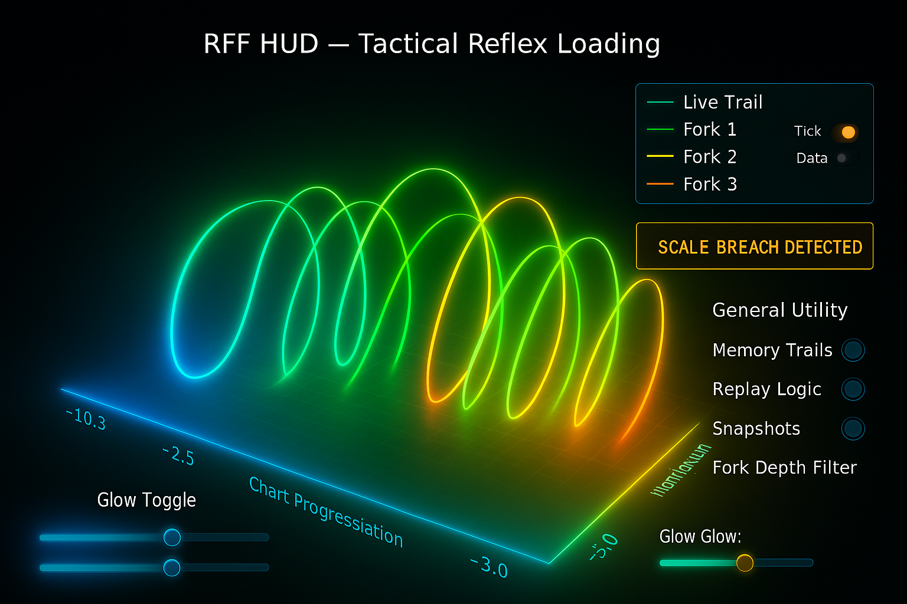
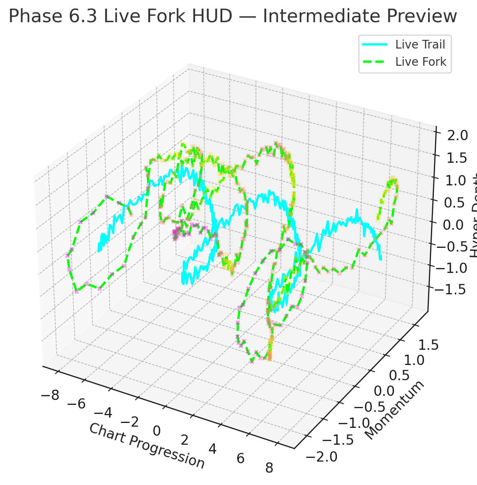
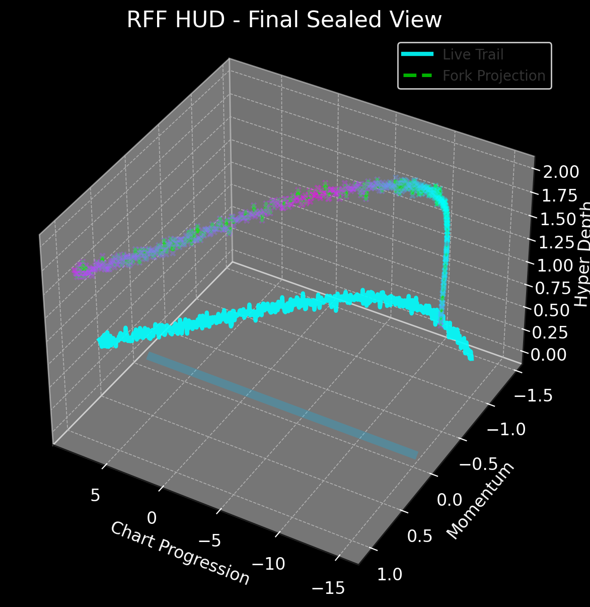

# 🔮 Route Finder Finance (RFF) v1.0

**RFF** is a cutting-edge AI-based prediction system that interprets real-time stock market chart visuals to learn, adapt, and predict future price movements through a powerful visual interface. Designed with a Flywheel-based AI core, RFF leverages zone detection, trail tracking, and hyper-intelligent HUD overlays to turn every trade into a strategic decision.

---

## ⚙️ Formula Backbone

RFF = f(Mt, Pt, Tt, Ht, Wt, Rt)

yaml
Always show details

Copy

- **Mt** — Market movement (chart feed from Chart 1,2,3,4)
- **Pt** — Player position tracking (via pixel and glow)
- **Tt** — Time synchronization (IST or purchase timer)
- **Ht** — Hyperbolic HUD curvature mapped in real-time
- **Wt** — Wait state intelligence and reward logic
- **Rt** — Route tracking and trail parsing (color based)

---

## 🌌 Key Features

- ✅ **Live Screen Input** with pixel-perfect trail extraction
- ✅ **Flywheel Prediction Engine** with Fork Logic
- ✅ **Realtime Chart Stitching** from 4 zoom levels
- ✅ **HUD Interface** inspired by Tony Stark x Avatar
- ✅ **Dynamic Fork Intelligence** overlays with confidence %
- ✅ **Wait State AI** that knows when *not to trade*
- ✅ **Scale Breach Detection + Auto Recalibration**
- ✅ **Tick Data Mode (if file provided)**

---

## 📷 Screenshots

### 🎯 Tactical HUD with Fork Logic Overlay


### 🧠 AI Trail Detection Logic


### 🔄 Turntable 3D Curve Visualizer


---

## 🛠️ Installation

```bash
git clone https://github.com/Baitudi/RFF-v1.0.git
cd RFF-v1.0
pip install -r requirements.txt
Ensure Python 3.11+ and Tesseract OCR are installed.

💡 Credits
Created by Deepak Nayak, Creator of RFF

Powered by ChatGPT, AI Architect and Engineer

Truth is more powerful than you think ⚡

🚧 Under Development
This project is a living, evolving intelligence system. Contributions and ideas are welcome! """